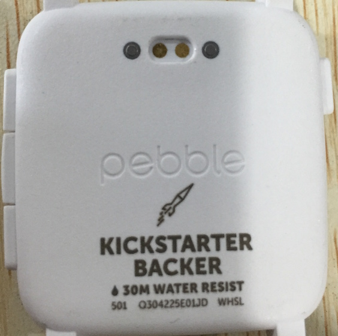
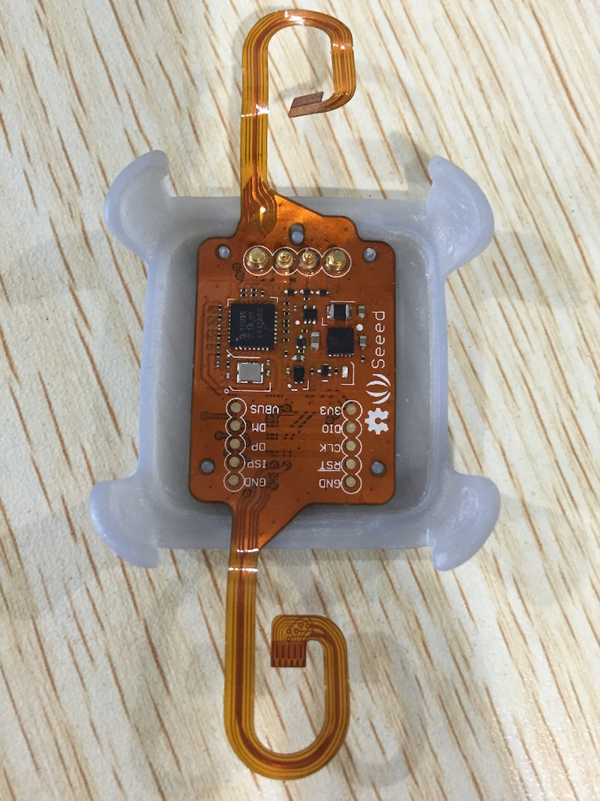

Pebble is the most popular smart watch with a strong ability in battery life and expanding its functionality. To gain good battery life, it was designed to have no onboard/native GPS device. People must have their phone carried along to enable it using geo information. But what if people just dont wanna carry the heavy phone when they run? Or what if have no pocket to put the phone in when they do cycling?

Now Pebble Time brings us a new possibility to super extend its functionality - the smartstrap interface.



With this interface, we have designed some gadgets to connect [Xadow](http://www.seeed.cc/wear/) with pebble. With Xadow, pebble pluses the wings of more sensors and wearable modules and is unlocked the limitation of the box. Tinkers and makers will have their unique Pebble+ with some interesting hacking. That will be fun.

Let's have a pitch :D



Geo information with Xadow-GPS: (please forget about the wires and the clip :D )


The smartstrap main board is also open for programming. After a few steps of workaround (soldering 4 wires to the SWD interface or the USB interface), one can program it with mbed libraries. That's easy enough. And with the communication protocol in pebble SDK, pebble app designers can easily read the sensors like this:

```c++
static void extract_data_from_stream(uint8_t req, uint8_t *buff, int len)
{
    switch(req)
    {
        case GET_VBAT:
        {
            if (len >= 4)
                memcpy(&vbat, buff, 4);
            break;
        }
        case GET_GPS:
        {
            if(len >= 18)
            {
                memcpy(&lat, buff, 4); buff+=4;
                memcpy(&lon, buff, 4); buff+=4;
                memcpy(&velocity, buff, 4); buff+=4;
                memcpy(&alt, buff, 4); buff+=4;
                memcpy(&fix, buff, 1); buff+=1;
                memcpy(&sat, buff, 1);
            }

            break;
        }
        ...
        default:
            break;
    }
}
```

That's where we get now. How do you think? Always prefer feedbacks and 吐槽s.

Click [here](http://www.seeed.cc/pebble_xadow/) to view the project's landing page.