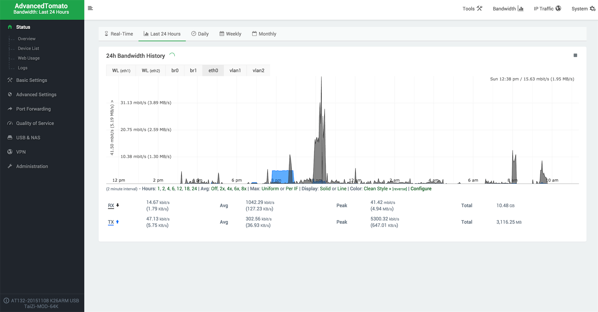

Xiaomi R1D router is a high performance Broadcom BCM4709 based router with builtin 1TB SATA HDD storage. The hardware of it is really royal except the software. After a painful struggle on the stock firmware of R1D, I decide to give up the kitchen sicker stock firmware.

The stuff we can play with R1D are:

- Flash the Tomato firmware (alternative advanced tomato with better UI)
- Builtin NAS support of tomato with services: USB storage, FTP, samba, DLNA
- Remote access with DDNS support
- Remote offline downloader - Xware downloader from thunder (迅雷)
- Sync files with Baidu cloud storage - syncy.py
- And the released opkg capability of openwrt system for unlimited hacking

The guide can be easily searched with google.

Now I'm very satisfied with the advanced tomato system, thanks to the developers of tomato and advanced tomato system!

